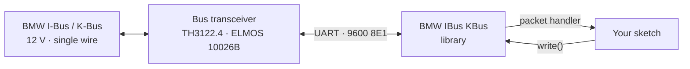
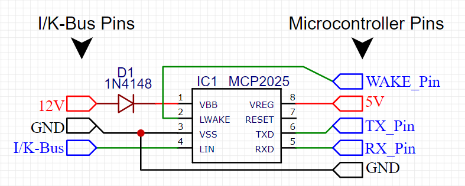
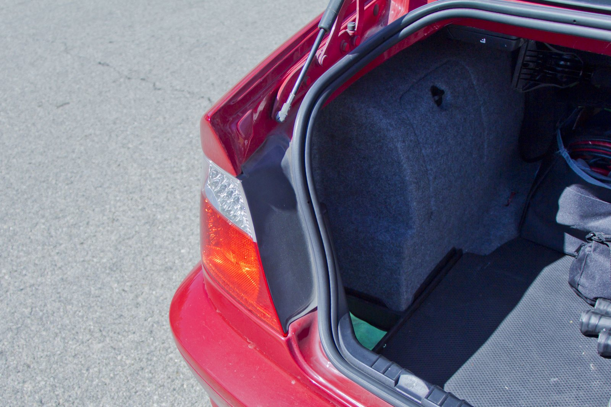
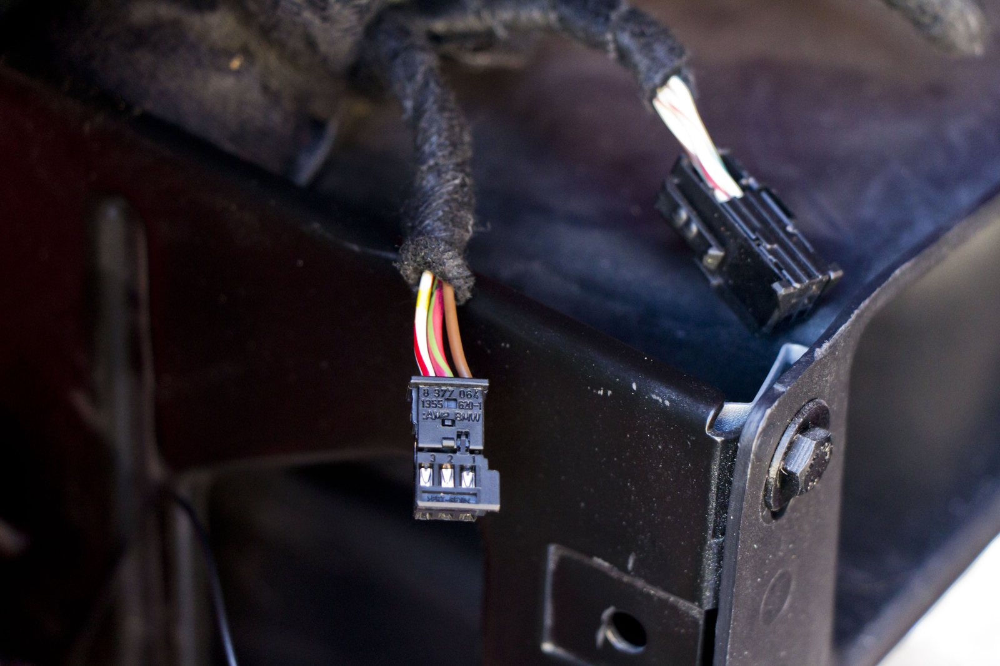
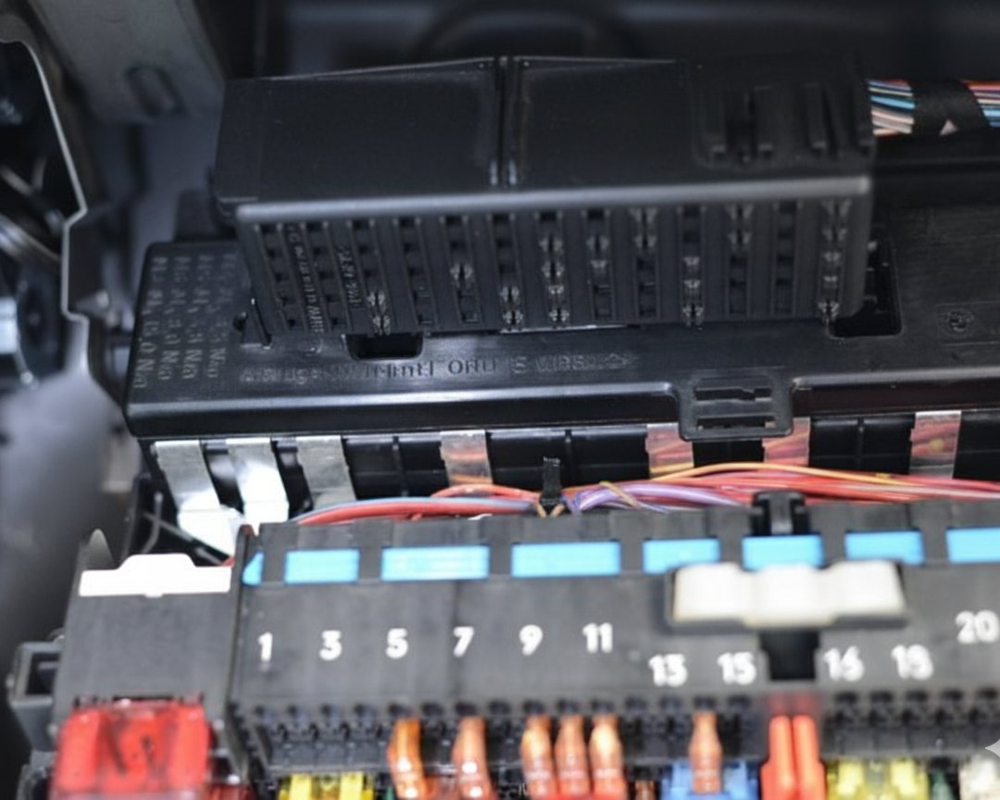
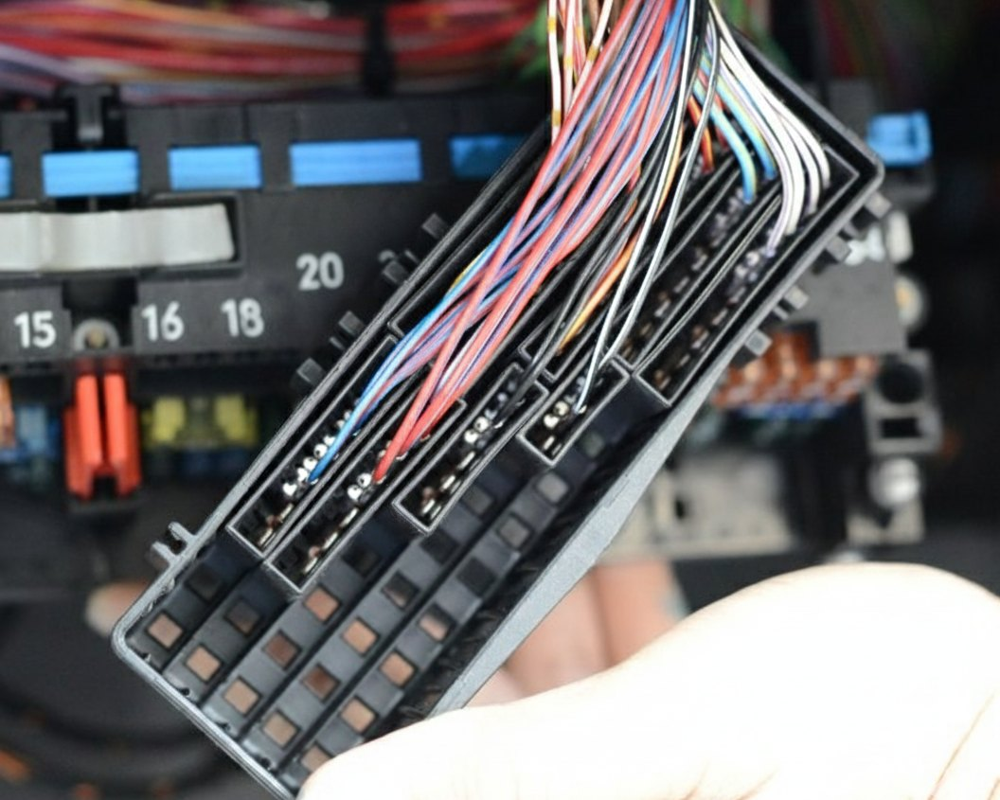
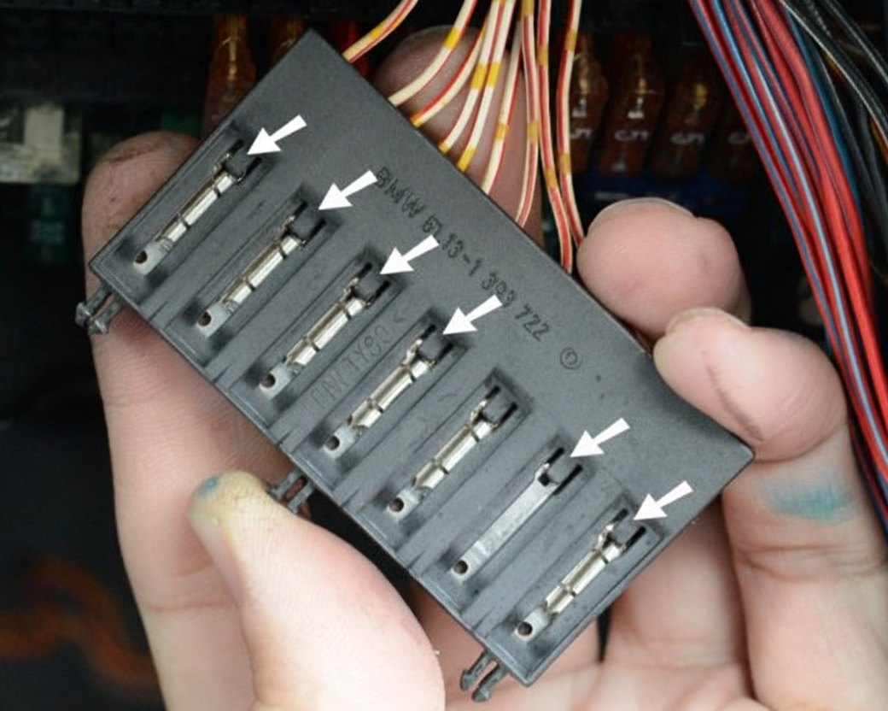

<div align="center">



# BMW I-Bus / K-Bus Library

**Read, decode and send BMW I-Bus and K-Bus messages from your own sketch.**<br>
A compact library for Arduino, ESP32, STM32 and Raspberry Pi Pico that handles framing, checksums and bus arbitration, so you can sniff bus traffic or control lights, windows, locks and radio on classic BMWs — E46, E39, E38, E53 and more.

[](https://github.com/muki01/BMW_IBus_KBus_Library/stargazers)
[](https://github.com/muki01/BMW_IBus_KBus_Library/forks)
[](https://github.com/muki01/BMW_IBus_KBus_Library/issues)
[](LICENSE)
[](https://github.com/muki01/BMW_IBus_KBus_Library/actions/workflows/arduino-ci.yml)


[Installation](#-installation) ·
[Quick Start](#-quick-start) ·
[API](#-api-reference) ·
[Wiring](#-wiring) ·
[Examples](#-examples) ·
[Where to Connect](#-where-to-connect-bmw-e46) ·
[FAQ](#-faq) ·
[Firmware Project](https://github.com/muki01/BMW_IBus_KBus)

</div>

---

## 🌟 Overview

Classic BMWs link their body and infotainment modules over a **single 12 V wire**: the **I-Bus** and **K-Bus**. Every key-fob click, steering-wheel button and light switch travels across it as a short serial message at **9600 baud, 8E1**.

**BMW IBus KBus** is the library that puts your microcontroller on that bus. You register a callback, call `run()` in your loop, and the library does the rest.



Looking for ready-to-flash firmware? The companion project **[BMW_IBus_KBus](https://github.com/muki01/BMW_IBus_KBus)** has complete sketches for the ESP32 and the Arduino Nano — a web interface to control the car from your phone, welcome lights and follow-me-home — together with an E46 message table.

## ✨ Features

- 📥 **Reliable receiving** — a state machine finds frame boundaries in the byte stream and verifies every checksum.
- 📤 **Safe transmitting** — messages are queued and sent only after the bus has been idle, so they never collide with the car's own traffic.
- 🧮 **Automatic checksums** — define a message without its checksum and the library appends it, or send a complete frame unchanged.
- 🎯 **Source filter** — receive everything, or only the modules you care about.
- 💤 **Sleep support** — powers the transceiver down after a period of bus silence, like the car's own modules.
- 🔎 **Built-in debug output** — every received and transmitted frame as hex on any `Stream`.
- 📍 **Configurable pins** and an optional header with more than 80 named module addresses.

## 📡 Supported Vehicles

| Chassis | Series | Years | I-Bus | K-Bus |
| :-- | :-- | :-- | :-: | :-: |
| **E31** | 8 Series | 1989–1999 | ✅ | |
| **E38** | 7 Series | 1994–2001 | ✅ | ✅ |
| **E39** | 5 Series | 1995–2004 | ✅ | ✅ |
| **E46** | 3 Series | 1997–2006 | | ✅ |
| **E52** | Z8 | 2000–2003 | | ✅ |
| **E53** | X5 | 1999–2006 | ✅ | ✅ |
| **E83** | X3 | 2003–2010 | | ✅ |
| **E85** | Z4 | 2002–2008 | | ✅ |
| **E87** | 1 Series | 2004–2013 | | ✅ |

## 📦 Installation

**Arduino IDE Library Manager** — the library is on its way into the Library Manager. As soon as it is listed, open **Sketch → Include Library → Manage Libraries…**, search for **BMW IBus KBus** and click **Install**.

**ZIP file** — until then, download this repository as a ZIP (**Code → Download ZIP**) and choose **Sketch → Include Library → Add .ZIP Library…**

**Git** — or clone it into your `libraries` folder:

```bash
git clone https://github.com/muki01/BMW_IBus_KBus_Library.git
```

**PlatformIO** — add it to `platformio.ini`:

```ini
lib_deps = https://github.com/muki01/BMW_IBus_KBus_Library.git
```

## 🚀 Quick Start

```cpp
#include <BMW_IBus_KBus.h>
#include <SoftwareSerial.h>

SoftwareSerial debugSerial(7, 8);          // RX, TX — to a USB-serial adapter
BMW_IBus_KBus ibus;

void startTimer() {                        // called on every SEN/STA level change
  ibus.startTimer();
}

void setup() {
  debugSerial.begin(9600);
  ibus.setIbusSerial(Serial);              // bus on the hardware UART (9600 8E1)
  ibus.setIbusDebug(debugSerial);          // print every frame as hex
  ibus.setIbusPacketHandler(packetHandler);
  attachInterrupt(digitalPinToInterrupt(3), startTimer, CHANGE);
}

void loop() {
  ibus.run();
}

void packetHandler(byte *packet) {
  byte source      = packet[0];            // sender module
  byte length      = packet[1];            // bytes that follow (destination … checksum)
  byte destination = packet[2];            // target module
  byte command     = packet[3];            // message type, followed by data bytes

  if (source == 0x50 && destination == 0x68 && command == 0x32) {
    // steering wheel → radio: volume button
  }
}
```

Example debug output:

```text
Good Message -> 50 04 68 32 11 1F
Good Message -> 00 04 BF 72 22 EB
Good Message -> 80 04 BF 11 01 2B
```

> [!TIP]
> On the Arduino Nano and Uno the bus uses the hardware UART (D0 / D1), which is shared with USB. Disconnect the transceiver from D0 / D1 while uploading.

### Sending a message

Store the message in `PROGMEM` **without** its checksum. The library calculates and appends the checksum, then transmits as soon as the bus is idle.

```cpp
// diagnostic interface → body module: switch the interior light on
const byte Interior_On[] PROGMEM = {0x3F, 0x05, 0x00, 0x0C, 0x01, 0x01};

ibus.write(Interior_On, sizeof(Interior_On));
```

If a message already ends with its checksum, pass `false` as the third argument and it is sent unchanged:

```cpp
const byte Interior_On_Full[] PROGMEM = {0x3F, 0x05, 0x00, 0x0C, 0x01, 0x01, 0x36};

ibus.write(Interior_On_Full, sizeof(Interior_On_Full), false);
```

### Filtering by module

By default every valid message reaches your packet handler. To receive only certain modules, pass their addresses:

```cpp
#include <BMW_IBus_KBus_Modules.h>

const byte sourceFilter[] = {M_GM5, M_MFL, M_RAD};   // body module, steering wheel, radio

ibus.setSourceFilter(sourceFilter, sizeof(sourceFilter));
```

## 📘 API Reference

| Method | Description |
| :-- | :-- |
| `setIbusSerial(serial)` | Attach the bus to a hardware UART and configure it for 9600 8E1. |
| `setIbusPacketHandler(fn)` | Register the function called for every valid message: `void fn(byte *packet)`. |
| `setIbusDebug(stream)` | Mirror all received and transmitted messages to any `Stream` as hex. |
| `setPins(senSta, enable, led)` | Select the SEN/STA, EN and activity-LED pins. Defaults: `3`, `4`, `13`. |
| `setSourceFilter(sources, count)` | Pass only messages from the listed modules to the handler. `count` `0` disables the filter. |
| `write(message, size)` | Queue a `PROGMEM` message; the checksum is calculated and appended. |
| `write(message, size, false)` | Queue a `PROGMEM` message that already includes its checksum. |
| `sleepEnable(seconds)` | Pull EN low after this many seconds without a valid message. |
| `startTimer()` | Call from the SEN/STA pin-change interrupt to track bus-idle time. |
| `run()` | Call continuously from `loop()` — receives, parses and transmits. |
| `calculateChecksum(data, length)` | Return the XOR checksum of a buffer in RAM. |

The packet passed to the handler is the complete frame:

| Index | Field | Description |
| :-- | :-- | :-- |
| `packet[0]` | Source | Sender module address |
| `packet[1]` | Length | Number of bytes that follow |
| `packet[2]` | Destination | Target module address |
| `packet[3]` | Command | Message type |
| `packet[4…]` | Data | Payload, followed by the checksum |

## 🔌 Wiring

The bus idles at battery voltage — never connect it directly to a microcontroller pin. The library is designed around the **TH3122.4 / ELMOS 10026B** bus transceiver:


| Transceiver pin | Arduino Nano / Uno | Purpose |
| :-- | :-- | :-- |
| TXD | `D0` (RX) | Bus → microcontroller |
| RXD | `D1` (TX) | Microcontroller → bus |
| SEN/STA | `D3` | Bus-idle detection before transmitting |
| EN | `D4` | Transceiver enable / sleep |
| — | `D13` | Bus activity LED |

Use `setPins()` when your board needs different pins. SEN/STA must be connected to an interrupt-capable pin.

<details>
<summary><b>Alternative interface circuits</b></summary>

<br>

**Optocouplers (PC817)** — built from common parts; well suited to sniffing.


**MCP2025 LIN transceiver** — compact, with a built-in voltage regulator.



These circuits have no SEN/STA output. Receiving works as shown; for transmitting, the library expects a bus-idle signal on the SEN/STA pin.

</details>

### Sleep mode

With the TH3122 / ELMOS transceiver powering the microcontroller from its 5 V regulator, `sleepEnable(60)` pulls EN low after 60 seconds of bus silence. The transceiver switches the regulator off, and bus activity wakes everything up again.

## 🧩 Platform Support

| Platform | Status |
| :-- | :-- |
| Arduino Nano / Uno / Mega (ATmega328P, ATmega2560) | ✅ Reference platform — developed on an Arduino Nano in a BMW E46 |
| ESP32 | 🧪 Experimental — compiles on Arduino-ESP32 2.x and 3.x, not yet verified in a vehicle |
| Raspberry Pi Pico, STM32, UNO R4 | 🧪 Experimental — compiles, not yet verified in a vehicle |

On ESP32 the examples use `Serial2` for the bus and USB for debug output. Mark your interrupt function with `IBUS_ISR_ATTR` so that it is placed in RAM:

```cpp
void IBUS_ISR_ATTR startTimer() {
  ibus.startTimer();
}
```

If you run the library on one of the experimental platforms, please [report how it went](https://github.com/muki01/BMW_IBus_KBus_Library/issues).

## 🧪 Examples

| Example | What it shows |
| :-- | :-- |
| [`Bus_Reader`](examples/Bus_Reader) | Print every message on the bus — start here. |
| [`Send_Command`](examples/Send_Command) | Send a message to the car, with and without a pre-calculated checksum. |
| [`Key_Fob_Events`](examples/Key_Fob_Events) | Filter by module and react to the lock, unlock and trunk buttons of the remote key. |

Complete vehicle firmware — welcome lights, goodbye lights, follow-me-home and an ESP32 web interface — and a table of more than 100 E46 messages live in the [companion project](https://github.com/muki01/BMW_IBus_KBus).

## 📍 Where to Connect (BMW E46)

The I/K-Bus is **not** available on the OBD-II port. The easiest access point is the **CD-changer connector** in the trunk, which is pre-wired on most cars and provides power, ground and the bus in one plug.

<table>
  <tr>
    <td width="33%"></td>
    <td width="33%"></td>
    <td width="33%"></td>
  </tr>
  <tr>
    <td align="center"><b>1.</b> Open the trunk — driver's side</td>
    <td align="center"><b>2.</b> Remove the trim to reach the bracket</td>
    <td align="center"><b>3.</b> The 3-pin connector <b>X18180</b></td>
  </tr>
</table>

| Wire colour | Signal |
| :-- | :-- |
| ⚪🔴🟡 White / red with yellow dots | **K-Bus** |
| 🔴🟢 Red / green | **+12 V** |
| 🟤 Brown | **Ground** |

<details>
<summary><b>Alternative: the K-Bus junction block above the fuse box</b></summary>

<br>

<table>
  <tr>
    <td width="50%"></td>
    <td width="50%"></td>
  </tr>
  <tr>
    <td align="center"><b>1.</b> Locate the connector block above the fuse box</td>
    <td align="center"><b>2.</b> Unclip it and pull it out</td>
  </tr>
  <tr>
    <td></td>
    <td></td>
  </tr>
  <tr>
    <td align="center"><b>3.</b> Find the K-Bus junction block</td>
    <td align="center"><b>4.</b> All white / red / yellow wires are K-Bus</td>
  </tr>
</table>

</details>

## 📨 Message Format

```text
 50    04    68    32    11    1F
 │     │     │     │     │     └─ Checksum     XOR of all previous bytes
 │     │     │     │     └─────── Data         one or more bytes
 │     │     │     └───────────── Command      message type
 │     │     └─────────────────── Destination  0x68 = radio
 │     └───────────────────────── Length       number of bytes that follow
 └─────────────────────────────── Source       0x50 = multifunction steering wheel
```

Include `BMW_IBus_KBus_Modules.h` to use names such as `M_MFL`, `M_RAD`, `M_IKE` and `M_LCM` instead of raw addresses.

## ❓ FAQ

<details>
<summary><b>What is the difference between the I-Bus and the K-Bus?</b></summary>

Electrically and logically they are the same protocol. The <b>I-Bus</b> (<i>Instrument / Information Bus</i>) connects infotainment devices such as the radio, navigation, telephone and steering-wheel buttons. The <b>K-Bus</b> (<i>Karosserie</i> — body bus) connects body electronics such as the general module, light module, climate control and rain sensor. Cars with both buses link them through the instrument cluster, which acts as a gateway. The E46 uses the K-Bus for everything.
</details>

<details>
<summary><b>Is the K-Bus the same as the K-Line or OBD-II?</b></summary>

No. The <b>K-Line</b> (ISO 9141 / KWP2000) is the diagnostic line on the OBD-II port. The <b>K-Bus</b> is the car's internal body network and is not present on the OBD-II connector. For K-Line diagnostics see the <a href="https://github.com/muki01/OBD2_KLine_Library">OBD2 K-Line Library</a>.
</details>

<details>
<summary><b>Can I connect the bus directly to a microcontroller pin?</b></summary>

No. The bus idles at battery voltage and will destroy a 5 V or 3.3 V input. Always use a transceiver circuit — see <a href="#-wiring">Wiring</a>.
</details>

<details>
<summary><b>Is it only for Arduino boards?</b></summary>

No. It is written for the Arduino framework, so it also builds for the ESP32, STM32, Raspberry Pi Pico and UNO R4. See <a href="#-platform-support">Platform Support</a> for what has been verified.
</details>

<details>
<summary><b>Where can I find messages for my car?</b></summary>

The <a href="https://github.com/muki01/BMW_IBus_KBus">firmware project</a> contains a table of more than 100 messages for the BMW E46 — lights, windows, locks, wipers and more — together with complete sketches.
</details>

## 🤝 Contributing

Contributions are welcome — especially test reports from the experimental platforms and from other chassis. Please read the **[Contributing Guide](CONTRIBUTING.md)** and the **[Code of Conduct](CODE_OF_CONDUCT.md)**, then open an [issue](https://github.com/muki01/BMW_IBus_KBus_Library/issues/new/choose) or a pull request.

## 🔗 Related Projects

This library is part of a family of open-source automotive projects. They share the same hardware approach, so what you build for one carries over to the others.

<table>
  <tr>
    <th colspan="3" align="left">Firmware — flash it and use it</th>
  </tr>
  <tr>
    <td width="30%"><a href="https://github.com/muki01/BMW_IBus_KBus"><b>BMW I-Bus / K-Bus Firmware</b></a></td>
    <td>Phone control and key-fob light functions for the BMW E46, on the ESP32 and Arduino.</td>
    <td width="96" align="center"><a href="https://github.com/muki01/BMW_IBus_KBus/stargazers"></a></td>
  </tr>
  <tr>
    <td width="30%"><a href="https://github.com/muki01/OBD2_K-line_Reader"><b>OBD2 K-Line Reader</b></a></td>
    <td>Scan tool for K-Line cars (ISO 9141-2, KWP2000) with a web dashboard, for the ESP32, ESP8266 and Arduino.</td>
    <td width="96" align="center"><a href="https://github.com/muki01/OBD2_K-line_Reader/stargazers"></a></td>
  </tr>
  <tr>
    <td width="30%"><a href="https://github.com/muki01/OBD2_CAN_Bus_Reader"><b>OBD2 CAN Bus Reader</b></a></td>
    <td>Scan tool for CAN bus cars (ISO 15765-4) with the same web dashboard, for the ESP32.</td>
    <td width="96" align="center"><a href="https://github.com/muki01/OBD2_CAN_Bus_Reader/stargazers"></a></td>
  </tr>
  <tr>
    <td width="30%"><a href="https://github.com/muki01/VAG_KW1281"><b>VAG KW1281</b></a></td>
    <td>KW1281 diagnostics for VW, Audi, Škoda and SEAT: ECU information, measuring groups and fault codes.</td>
    <td width="96" align="center"><a href="https://github.com/muki01/VAG_KW1281/stargazers"></a></td>
  </tr>
  <tr>
    <th colspan="3" align="left">Libraries — build your own firmware</th>
  </tr>
  <tr>
    <td width="30%"><b>BMW IBus KBus Library</b><br><sub>you are here</sub></td>
    <td>Receives, checks and sends BMW I-Bus and K-Bus messages; the library behind the BMW firmware.</td>
    <td width="96" align="center"><a href="https://github.com/muki01/BMW_IBus_KBus_Library/stargazers"></a></td>
  </tr>
  <tr>
    <td width="30%"><a href="https://github.com/muki01/OBD2_KLine_Library"><b>OBD2 K-Line Library</b></a></td>
    <td>K-Line diagnostics behind one API: ISO 9141-2, KWP2000, KW1281, DS2 and KW82.</td>
    <td width="96" align="center"><a href="https://github.com/muki01/OBD2_KLine_Library/stargazers"></a></td>
  </tr>
  <tr>
    <td width="30%"><a href="https://github.com/muki01/OBD2_CAN_Bus_Library"><b>OBD2 CAN Bus Library</b></a></td>
    <td>OBD-II diagnostics over ISO 15765-4 with the ESP32's built-in CAN controller.</td>
    <td width="96" align="center"><a href="https://github.com/muki01/OBD2_CAN_Bus_Library/stargazers"></a></td>
  </tr>
  <tr>
    <th colspan="3" align="left">Interface</th>
  </tr>
  <tr>
    <td width="30%"><a href="https://github.com/muki01/OBD2-Diagnostic-UI"><b>OBD2 Diagnostic UI</b></a></td>
    <td>The web dashboard used by the two OBD2 readers.</td>
    <td width="96" align="center"><a href="https://github.com/muki01/OBD2-Diagnostic-UI/stargazers"></a></td>
  </tr>
</table>

## 💼 Custom Development

I design automotive diagnostic tools, firmware and hardware professionally. Whether you need a complete product or only the communication layer, I can help.

| Service | Details |
| :-- | :-- |
| **Protocol implementation** | BMW I/K-Bus, K-Line (ISO 9141-2 / KWP2000), CAN / UDS, VAG KW1281 and other manufacturer-specific protocols |
| **ECU communication & reverse engineering** | Bus sniffing, packet decoding, module control, undocumented ECUs and buses |
| **ECU security access** | Seed-key algorithms and unlock routines for KWP2000 / UDS |
| **Embedded firmware** | Arduino, ESP32, ESP8266, STM32, Raspberry Pi Pico |
| **Custom hardware** | Diagnostic dongles, shields and PCBs designed to your requirements |
| **Companion apps** | Android, iOS and web apps to visualise, log and control your device |

Have a project in mind? Reach out through the [Contact](#-contact) section below.

## 📬 Contact

For custom development, collaboration, sponsorship or ready-made devices:

| Channel | Address |
| :-- | :-- |
| 📧 **Email** | [muksin.muksin04@gmail.com](mailto:muksin.muksin04@gmail.com) |
| 💼 **LinkedIn** | [linkedin.com/in/muksin-muksin](https://www.linkedin.com/in/muksin-muksin/) |
| 🐙 **GitHub** | [@muki01](https://github.com/muki01) |

## ☕ Support the Project

[](https://www.buymeacoffee.com/muki01)
[](https://www.paypal.com/donate/?hosted_button_id=SAAH5GHAH6T72)
[](https://github.com/sponsors/muki01)

## ⚠️ Disclaimer

> [!WARNING]
> This is a hobby and development project. Transmitting on a live vehicle bus can affect lighting, locking and other body functions. Test with the vehicle stationary and proceed at your own risk. The author accepts no responsibility for damage or malfunction.

BMW is a registered trademark of BMW AG. This project is independent and is not affiliated with, endorsed by or sponsored by BMW AG.

## 📄 License

Released under the **[GNU General Public License v3.0](LICENSE)**.

- You are free to use, study, modify and share this library.
- If you distribute it — on its own or as part of a product or firmware — you must make the complete source available under the same license.

**Closed-source or commercial product?** A separate commercial license is available. Get in touch through the [Contact](#-contact) section.

Copyright © 2025–2026 Muksin Muksin.

---

<div align="center">

Created by [**Muki**](https://github.com/muki01) · If this library helped you, please give it a ⭐

<sub>BMW · I-Bus · K-Bus · IBus · KBus · E46 · E39 · E38 · E53 · Arduino · ESP32 · STM32 · Raspberry Pi Pico · TH3122 · car hacking</sub>

</div>
